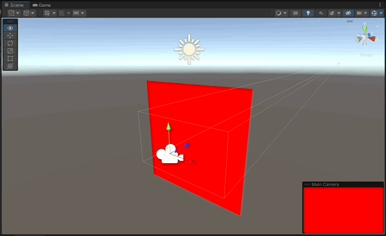
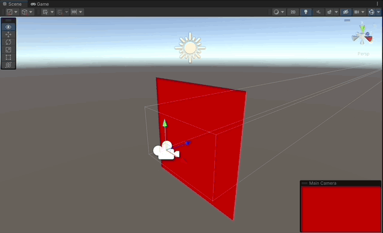

# Unity Shaders Practice
A collection of basic Shaders written in **Cg** for the **Built-in RP** in Unity.

### Course
[Learn Unity Shaders from Scratch - Nocholas Lever](https://www.udemy.com/course/learn-unity-shaders-from-scratch)

## Shaders
1. [Simple Red Unlit Shader](#simple-red-unlit-shader)
1. [Color over Time Unlit Shader](#color-over-time-unlit-shader)
1. [With Exposed Properties Unlit Shader](#with-exposed-properties-unlit-shader)
1. [Interpolated UVs Unlit Shader](#interpolated-uvs-unlit-shader)

## Simple Red Unlit Shader
- Simplest `Cg` Shader code.
- No fog or any lighting calculation.
- No Properties in `ShaderLab`.
- Just one `SubShader` with one `Pass`.
- No override for the `Vertex Shader`.
- Simply returns a `fixed4(1,0,0,1)` for all pixels.

```c
fixed4 frag (v2f_img i) : SV_Target
{
    return fixed4(1,0,0,1);
}
```



## Color over Time Unlit Shader
- Same structure as the simple red unlit shader.
- Uses the `sin()` and `cos()` functions to oscillate the colors.
- Uses the `Unity` `uniform` variable `_Time`, to change the color over time.


```c
fixed4 frag (v2f_img i) : SV_Target
{
    fixed redChannel = (sin(_Time.w) + 1) / 2;
    fixed blueChannel = (cos(_Time.w) + 1) / 2;

    fixed3 color = fixed3(redChannel, 0, blueChannel);

    return fixed4(color, 1); // oscillate between RED and BLUE

    // swizzling

    // return fixed4(color, 1).gbra; // oscillate between GREEN and BLUE
    // return fixed4(color, 1).rrra; // gray scale
    // return fixed4(color, 1).xxxw; // gray scale
}
```



## With Exposed Properties Unlit Shader
- Same structure as previous shaders.
- Exposes `_ColorA` and `_ColorB` to the Unity Editor, using `ShaderLab`.
- Uses the `lerp` function to blend between the two colors.

```c
Properties
{
    _ColorA("Color A", Color) = (1,0,0,1)
    _ColorB("Color B", Color) = (0,0,1,1)
}
SubShader
{
    // subshader code

    Pass
    {
        CGPROGRAM
        // pass code

        fixed4 _ColorA;
        fixed4 _ColorB;

        fixed4 frag (v2f_img i) : SV_Target
        {
            float delta = (sin(_Time.w) + 1) / 2;
            fixed3 color = lerp(_ColorA, _ColorB, delta);

            return fixed4(color, 1);

            // return _ColorA; // just Color A
            // return _ColorA.grba; // swaps Red with Green
        }
        ENDCG
    }
}
```


## Interpolated UVs Unlit Shader
- Same structure as previous shaders.
- Uses the `i.uv.x` interpolated value coming from the `v2f_img` struct from the `Vertex Shader` as the delta.

```c
fixed4 frag (v2f_img i) : SV_Target
{
    float delta = i.uv.x;
    fixed3 color = lerp(_ColorA, _ColorB, delta);

    return fixed4(color, 1.0);
}
```


